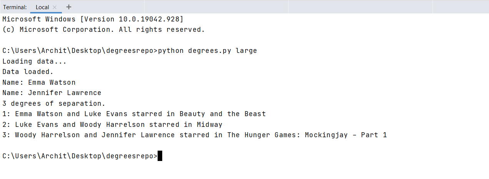
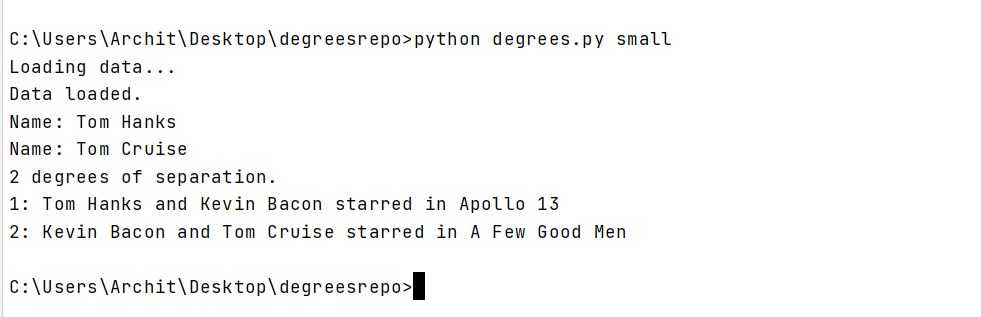
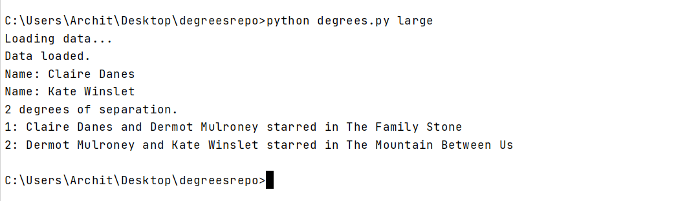
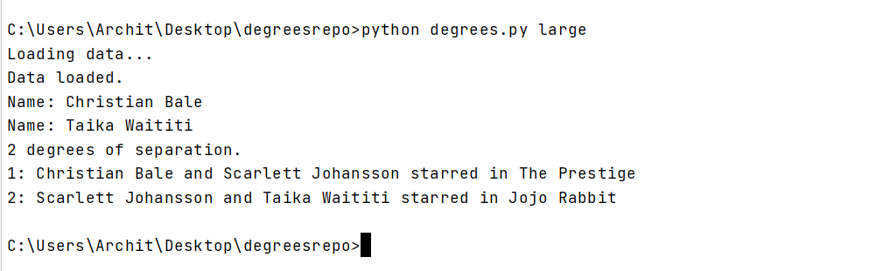
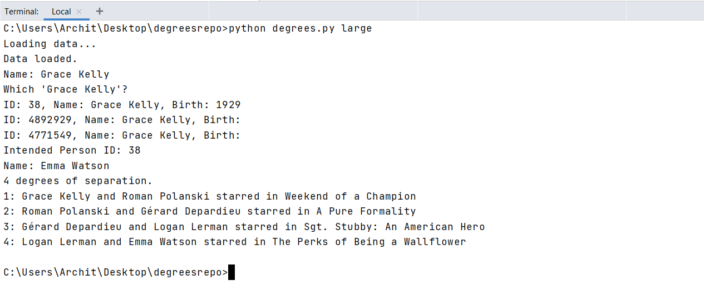

# Degrees

### Description
In this program we will be needing to input the two names of the actors and this program will tell you the shortest path of the movies by which they are connected.  
Implemented using the Breadth First Search.
***
**To explore the dataset you can see the small and large directries!**
***
Example screenshots:  
1.
2.***
3.
4.***
5.
6.***
7.
8.***
9.
***
### How to Run:
```Bash
python degrees.py *nameofdtataset*
```
**Note: If you load the large dataset then it will take some time to load!**
